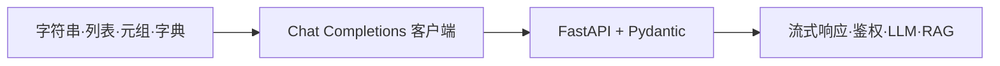

# Python 重返手记：从语法复习到 FastAPI 最小服务

> **背景（略）**  
> 笔者高中阶段接触过 Python，毕业后长期以前端（JavaScript / TypeScript）为主；在 AI 应用开发技术栈中，Python 重新成为高频语言。下文按练习代码串联知识点，叙事从简。

---

## 1. AI 语境下为何重返 Python

与「算法课入门语言」不同，当前 AI 应用开发中 Python 多承担**编排与集成**角色：

- 模型与工具链：`transformers`、`LangChain`、`LlamaIndex` 等文档与示例以 `.py` 为主；
- 服务化：**FastAPI + Pydantic** 常用于将模型能力暴露为 HTTP API；
- 数据流水线：清洗、切片、入库脚本普遍用 Python 编写。

复习路径可概括为：**内置类型与脚本能力 → 大模型 HTTP 调用 → 自有 API 服务**。以下三节即按此顺序展开。

---

## 2. 内置类型：字符串、容器与数值

### 2.1 字符串

数据预处理、Prompt 拼接、日志输出中，字符串方法出现频率极高：

```python
my_name = ' zhang _an_Li.py'
print(my_name.title())   # 单词首字母大写（含 _、空格时需结合样例理解）
print(my_name.upper())
print(my_name.lower())
print(f"Hello, {my_name.title()}!")  # f-string
print("\t" + my_name)
print("\n" + my_name)
print(my_name.strip())
print(my_name.lstrip())
print(my_name.rstrip())
print(my_name.removeprefix(' zhang'))  # 3.9+
print(my_name.removesuffix('.py'))
```

| 方法 / 写法 | 作用 | 备注 |
|-------------|------|------|
| `str.title()` | 标题化大小写 | 对含 `_`、空格的字符串不宜想当然 |
| `strip` / `lstrip` / `rstrip` | 去空白 | 用户输入、文本清洗常用 |
| `removeprefix` / `removesuffix` | 按前缀/后缀删除 | 3.9+，语义优于手动切片 |
| f-string | 插值格式化 | 日常可读性优于 `%` 与 `str.format()` |

### 2.2 数值与命名约定

```python
print(0.1 + 0.2)  # 浮点二进制表示导致精度误差，非逻辑错误

TEST_SCORE = 85   # 全大写：模块级常量约定
print(TEST_SCORE)
```

金额、token 计费等场景需知晓浮点误差；必要时使用 `decimal.Decimal`，或以整数最小单位存储。

### 2.3 列表：拷贝与推导式

```python
array = [1, 2, None, 4, 5]
b = array[:]      # 浅拷贝：新列表对象，元素仍引用原对象
b[2] = 3
print(array[2])   # None
print(b)

print([v**2 for v in range(10)])  # [0, 1, 4, 9, ...]
```

| 写法 | 含义 |
|------|------|
| `lst[:]`、`list(lst)` | 浅拷贝，一层容器独立 |
| `copy.deepcopy()` | 嵌套可变结构需深拷贝时使用 |
| 列表推导式 | 紧凑的映射/过滤，可读性优于等价 `for` 循环 |

仅当列表元素本身为可变对象且被**原地修改**时，浅拷贝后的列表才会与原列表联动；对 `None`、数字等赋新值只影响副本。

### 2.4 元组与字典

```python
test = (12, 1)
print(test[0])

a = {1: 2, 3: 4}
print(a.items())  # dict_items；JSON 序列化前键常需转为 str
```

| 类型 | 可变性 | 典型用途 |
|------|--------|----------|
| `tuple` | 不可变 | 固定记录、多返回值、可哈希键 |
| `dict` | 可变 | 配置映射、计数、内存中的 JSON 形态 |

---

## 3. 大模型 API：OpenAI 兼容调用

语法复习之外，可用熟悉的前端栈先打通 **Chat Completions** 调用链：

```javascript
import "dotenv/config";
import OpenAI from "openai";

const openai = new OpenAI({
  baseURL: 'https://api.deepseek.com',
  apiKey: process.env.DEEPSEEK_API_KEY,
});

async function main() {
  const completion = await openai.chat.completions.create({
    messages: [{ role: "system", content: "..." }],
    model: "deepseek-v4-pro",
    thinking: { "type": "enabled" },
    reasoning_effort: "high",
    stream: false,
  });
  console.log(completion.choices[0].message.content);
}
```

| 要点 | 说明 |
|------|------|
| `baseURL` | 兼容 OpenAI 协议的厂商或中转端点 |
| `dotenv` + `API_KEY` | 密钥走环境变量，避免硬编码 |
| `messages` | 标准角色：`system` / `user` / `assistant` |
| `thinking` / `reasoning_effort` | 厂商扩展，深度推理类能力（以官方文档为准） |
| `stream: false` | 非流式，一次性返回 `content` |

同类逻辑在 Python 侧通常用 `openai` 或 `httpx` 实现；下一节的 FastAPI 则转向**提供** HTTP 服务，而非仅作为客户端消费 API。

---

## 4. FastAPI 最小 HTTP 服务

### 4.1 代码与语义

```python
from fastapi import FastAPI
from pydantic import BaseModel

app = FastAPI()

class Item(BaseModel):
    name: str
    price: float
    is_offer: bool | None = None

@app.get("/")
def read_root():
    return {"Hello": "World"}

@app.get("/items/{item_id}")
def read_item(item_id: int, q: str | None = None):
    return {"item_id": item_id, "q": q}

@app.put("/items/{item_id}")
def update_item(item_id: int, item: Item):
    return {"item_name": item.name, "item_id": item_id}
```

| 概念 | 说明 |
|------|------|
| `FastAPI()` | ASGI 应用入口，由 Uvicorn 等加载 |
| `@app.get` / `@app.put` | 绑定 HTTP 方法与路径 |
| `{item_id}` | 路径参数，自动解析为 `int`，类型不符返回 422 |
| `q: str \| None = None` | 可选查询参数，如 `/items/1?q=foo` |
| `Item(BaseModel)` | Pydantic 声明请求体字段与类型，进入视图前完成校验 |
| `return dict` | 自动序列化为 JSON 响应 |

**Pydantic 与 TypeScript**：字段注解类似 `interface`，并附带运行时校验；非法请求体在业务逻辑执行前被拒绝。

**联合类型**：`bool | None = None` 表示字段可省略（Python 3.10+）；等价于 `Optional[bool] = None`。

### 4.2 运行与调试

```bash
uvicorn main:app --reload
```

| 路径 | 作用 |
|------|------|
| `/` | 根路由 JSON |
| `/docs` | Swagger UI，在线试调 |
| `/redoc` | ReDoc 文档 |

习惯消费 REST API 的前端背景，在此完成从**调用方**到**提供方**的最小切换；后续可在此入口挂载 LLM 代理、RAG 检索等路由。

---

## 5. 知识链路与延伸



| 层次 | 内容 |
|------|------|
| 语言层 | 内置类型、字符串与容器语义 |
| 协议层 | Chat Completions；REST + JSON |
| 服务层 | 路径/查询/请求体建模，自动 OpenAPI 文档 |

常见下一步：`POST` 接收 Prompt、`StreamingResponse` 流式输出；`pydantic-settings` 管理密钥；`APIRouter` 拆分路由；CORS 供前端联调；Python `openai` 包复现客户端调用。

---

## 6. 结语

高中阶段 Python 侧重基础语法；在 AI 应用开发中，同一语言更多用于**数据整理、HTTP 服务封装、模型编排**。内置类型巩固脚本能力，OpenAI 兼容 SDK 打通模型调用，FastAPI 则补上最小可运行 API——三者构成「脚本 → 外部模型 → 自有服务」的紧凑入门链。

---

