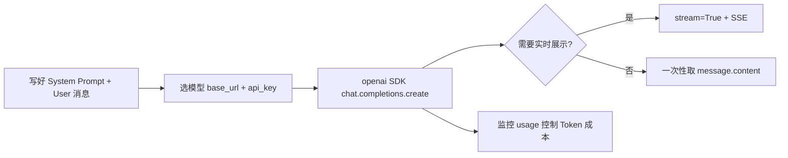

# AI 应用开发基础：提示词、模型选型、Token 与 OpenAI SDK

> 本文整合自 AI 应用开发学习笔记，涵盖提示词工程、主流大模型对比、Token 计费机制，以及 OpenAI Python SDK 的核心用法。适合作为入门阶段的速查与复习材料。

---

## 一、提示词工程（Prompt Engineering）

**本质**：给模型提供上下文和指令。形式不限，关键是**意图清晰、信息充分、约束明确**。

### 1.1 七种常见形式

| 类型 | 形式 | 适用场景 |
|------|------|---------|
| **直接对话** | 实时输入问题 | 日常开发、调试、学习 |
| **预写文档** | `.md` / `.txt` 需求与背景 | 复杂项目，需大量上下文 |
| **System Prompt** | API 中的角色设定（用户不可见） | 开发 AI 应用，定义行为与风格 |
| **Few-shot** | 输入→输出样例 | 固定格式输出、批量生成 |
| **模板/框架** | 结构化填空 | 复杂提示词，确保信息完整 |
| **Workflow** | 步骤化流程文档 | 重复任务自动化、团队规范 |
| **代码注释** | 注释 / Docstring | Copilot、Cascade 等辅助编程 |

**直接对话**示例：

```
"这段代码的 hasattr 是什么意思？"
"帮我把这个项目 Docker 化部署到阿里云"
```

**System Prompt**（给 API 设定角色）示例：

```
你是一个资深 Python 后端工程师，擅长 Django 和 FastAPI。
回答要简洁，用中文，给出代码示例。
不要解释基础概念，直接给解决方案。
```

**Few-shot**（教模型固定格式）示例：

```
输入：用户注册  →  输出：POST /api/auth/register
输入：用户登录  →  输出：POST /api/auth/login
输入：创建预约  →  输出：？  →  AI 推断：POST /api/appointments/
```

**常用模板框架**：

- **CRISPE**：Capacity（角色）、Request（请求）、Insight（背景）、Statement（指令）、Personality（风格）、Experiment（实验）
- **CO-STAR**：Context（背景）、Objective（目标）、Style（风格）、Tone（语气）、Audience（受众）、Response（输出格式）

### 1.2 核心原则

> 好的提示词 = **清晰的意图 + 充分的上下文 + 明确的约束**

日常开发中，多数场景用「直接对话 + 简短 System Prompt」即可；复杂项目再叠加预写文档、Few-shot 或 Workflow。

---

## 二、主流大模型对比与选型

### 2.1 模型一览

| 模型 | 厂商 | 优势 | 劣势 | 适用场景 |
|------|------|------|------|---------|
| GPT-4o | OpenAI | 综合能力强，生态成熟 | 贵，国内需代理 | 高质量要求 |
| Claude 3.5/4 | Anthropic | 长文本、代码能力强 | 国内需代理 | 代码生成、长文档分析 |
| DeepSeek V3/R1 | 深度求索 | 性价比高，推理强，国内直连 | 高峰可能排队 | 日常开发、成本敏感 |
| 通义千问 Qwen | 阿里 | 中文好，国内直连，有免费额度 | 英文稍弱 | 中文、阿里云生态 |
| 文心一言 ERNIE | 百度 | 中文理解好，国内直连 | 生态不如 OpenAI | 中文、百度云生态 |
| Llama 3 | Meta | 开源，可本地部署 | 需自部署，中文一般 | 本地、隐私敏感 |

### 2.2 选型建议

| 场景 | 推荐 |
|------|------|
| 学习 / 开发调试 | DeepSeek（便宜、国内直连） |
| 质量要求高 | GPT-4o 或 Claude |
| 成本敏感的生产 | DeepSeek 或通义千问 |
| 数据不能出本地 | Ollama + Llama / Qwen 开源模型 |
| 海外产品 | OpenAI 或 Claude |

### 2.3 工程实践

1. **开发用便宜模型，上线前用好模型验证效果**
2. **多数 API 兼容 OpenAI 格式**，换模型通常只改 `base_url` 和 `api_key`
3. **不要绑死单一模型**，在代码层做抽象，便于切换

---

## 三、Token 与计费

> 理解 Token 和计费，直接影响 RAG、Agent 的设计与成本控制。

### 3.1 Token 是什么

Token 是模型处理文本的**最小单位**，不是「一字一 Token」。

```
英文：1 个单词 ≈ 1–2 Token
中文：1 个汉字 ≈ 1–2 Token
代码：符号、关键字各算 Token

"Hello World" → 约 2 Token
"你好世界"    → 约 4 Token
```

### 3.2 计费方式

按 **输入 Token（Prompt）** 与 **输出 Token（Completion）** 分别计费。输入包括 System Prompt、历史对话、当前问题；输出为模型生成内容。**输出单价通常是输入的 2–3 倍**。

| 模型 | 输入（/百万 Token） | 输出（/百万 Token） |
|------|---------------------|---------------------|
| GPT-4o | ~$2.5 | ~$10 |
| Claude 3.5 Sonnet | ~$3 | ~$15 |
| DeepSeek V3 | ¥1 | ¥2 |
| 通义千问 Qwen-Plus | ¥0.8 | ¥2 |

> 价格常变动，以厂商官网为准。

### 3.3 上下文窗口（Context Window）

**输入 + 输出的 Token 总和不能超过窗口上限。**

| 模型 | 上下文窗口 |
|------|-----------|
| GPT-4o | 128K |
| Claude 3.5 Sonnet | 200K |
| DeepSeek V3 | 128K |
| Qwen-Plus | 128K |

### 3.4 对架构设计的影响

| 场景 | 要点 |
|------|------|
| **RAG** | 检索文档塞进 Prompt，过长需分块与筛选 |
| **Agent** | 多轮工具调用累积历史，需记忆管理 |
| **成本** | 单次 RAG 可能含数千 Token 上下文，调用量大时成本显著 |
| **选型** | 长文档场景优先选窗口更大的模型 |

### 3.5 实用技巧

- 用 `tiktoken` 在代码中估算 Token
- 开发时打印每次请求的 `usage`，心里有数
- **System Prompt 尽量短**——每次请求都会带上，重复计费

---

## 四、OpenAI SDK 详解

### 4.1 `openai` 是什么

`openai` 是 OpenAI 官方的 **Python SDK**，本质是封装好的 HTTP 客户端：

```bash
pip install openai
```

负责构造请求、发送 POST、解析 JSON。也可用 `requests` 手写，但 SDK 更省事。

### 4.2 为何「一个库调所有模型」

OpenAI 的 **Chat Completions API** 已成为事实标准，DeepSeek、通义千问、Ollama、OpenRouter 等均兼容：

```python
from openai import OpenAI

# OpenAI
client = OpenAI(api_key="sk-xxx")

# DeepSeek —— 只改 base_url 和 api_key
client = OpenAI(api_key="sk-xxx", base_url="https://api.deepseek.com")

# OpenRouter
client = OpenAI(api_key="sk-or-xxx", base_url="https://openrouter.ai/api/v1")

# 本地 Ollama
client = OpenAI(api_key="ollama", base_url="http://localhost:11434/v1")
```

**一套代码，换 `base_url` + `api_key` 即可切换模型。**

### 4.3 核心 API：`chat.completions.create`

```python
response = client.chat.completions.create(
    model="deepseek-chat",
    messages=[...],
    temperature=0.7,   # 0=更确定，1=更随机；写代码建议 0–0.3
    max_tokens=1000,   # 限制输出长度
    stream=False       # 是否流式
)
```

### 4.4 `messages` 三种角色

```python
messages = [
    {"role": "system", "content": "你是一个 Python 后端工程师"},
    {"role": "user", "content": "FastAPI 怎么做参数校验？"},
    {"role": "assistant", "content": "FastAPI 用 Pydantic..."},
    {"role": "user", "content": "给个代码示例"}
]
```

| 角色 | 作用 | 是否必须 |
|------|------|---------|
| `system` | 身份、行为、约束 | 可选，推荐 |
| `user` | 用户输入 | 必须 |
| `assistant` | 历史回答 | 多轮对话时需要 |

**多轮对话**：模型无状态，每次请求需带上完整历史。

### 4.5 响应与常用参数

```python
answer = response.choices[0].message.content

# Token 用量
response.usage.prompt_tokens
response.usage.completion_tokens
response.usage.total_tokens
```

| 参数 | 说明 |
|------|------|
| `model` | 如 `gpt-4o`、`deepseek-chat` |
| `messages` | 对话列表 |
| `temperature` | 0–2，越高越随机 |
| `max_tokens` | 限制输出，控制成本 |
| `stream` | 是否流式返回 |
| `top_p` | 与 temperature 类似，一般不同时调 |

### 4.6 流式输出（Stream）

**普通模式**：生成完毕后一次性返回。  
**流式模式**（`stream=True`）：边生成边返回，即 ChatGPT 网页版的「打字机效果」。

```python
# 流式
response = client.chat.completions.create(
    model=MODEL,
    messages=[{"role": "user", "content": "写一篇 500 字的文章"}],
    stream=True
)
for chunk in response:
    if chunk.choices[0].delta.content:
        print(chunk.choices[0].delta.content, end="", flush=True)
```

| 模式 | 取内容方式 |
|------|-----------|
| 普通 | `response.choices[0].message.content` |
| 流式 | `chunk.choices[0].delta.content` |

**为何需要流式**：长回答等待体验差；RAG、Agent 场景用户需实时看到进度。

**FastAPI + SSE 示例**（后端把 Stream 转成前端可消费的推送）：

```python
from fastapi import FastAPI
from fastapi.responses import StreamingResponse

app = FastAPI()

def generate_stream(message: str):
    response = client.chat.completions.create(
        model=MODEL,
        messages=[{"role": "user", "content": message}],
        stream=True
    )
    for chunk in response:
        if chunk.choices[0].delta.content:
            yield f"data: {chunk.choices[0].delta.content}\n\n"
    yield "data: [DONE]\n\n"

@app.get("/chat/stream")
def chat_stream(message: str):
    return StreamingResponse(
        generate_stream(message),
        media_type="text/event-stream"
    )
```

**Stream 与 SSE 的区别**（易混淆）：

| 概念 | 层面 | 作用 |
|------|------|------|
| **Stream** | 模型 API | 从模型一块块拿数据（`stream=True`） |
| **SSE** | HTTP | 服务器向浏览器推送（`text/event-stream`） |

完整聊天链路：`模型 Stream → 后端接收 → SSE 推前端 → 实时展示`。

**流式注意点**：

- Token 统计可能在最后一个 chunk，或需自行累计
- 传输中途可能断开，需 `try-except`
- 存库时需自行拼接所有 chunk 得到完整文本

```python
full_response = ""
for chunk in response:
    if chunk.choices[0].delta.content:
        content = chunk.choices[0].delta.content
        full_response += content
        print(content, end="", flush=True)
```

### 4.7 与 `requests` 的对应关系

SDK 等价于手写 POST + JSON 解析，结果一致，SDK 省去拼 URL、Header 与解析步骤。LangChain、LlamaIndex 等框架底层也常调用同一套 Chat Completions 接口。

---

## 五、串联：从提示词到上线的最小路径



1. **提示词**：System 定角色，User 提问题；复杂场景加 Few-shot 或预写文档  
2. **选型**：开发用 DeepSeek，上线前用目标模型验证  
3. **成本**：短 System Prompt、`max_tokens`、开发期打印 `usage`  
4. **调用**：`OpenAI(base_url=..., api_key=...)` + `messages` + 按需 `stream`  
5. **产品体验**：聊天类接口优先流式 + SSE  

---
